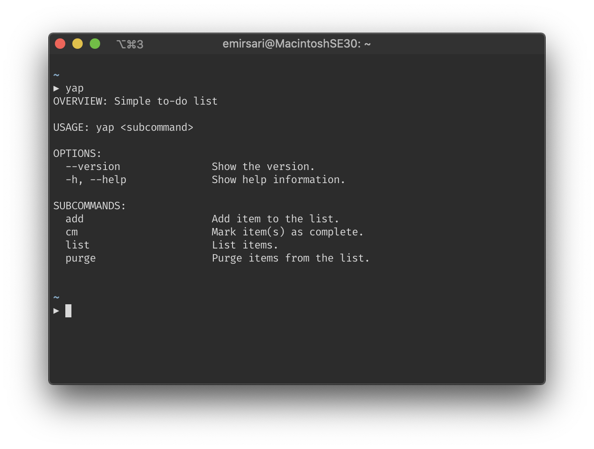

# yap

yap (pronounced y-ah-p) is a simple to-do list written in Swift. It allows you to add to-do 
items, mark them as "complete", list both completed and pending items, and purge both 
lists.

## Installation

Go to the Releases page and get the binary. If you have Swift 5.2 installed, you can also
build/install it yourself with the instructions below:

* Make sure you have $HOME in your $PATH
* Clone/download the repository
* Run `make install` inside the project directory

This will build and install `yap` in your home directory. Alternatively, you can run
`swift build`, then get the binary from `.build/release` folder.

## Help

* Type `yap` or `yap <subcommand> -h/--help` to see available options and flags.
* See [Documentation](Documentation.md)

## Known issues

* Only works on macOS at the moment.
* It might be necessary to manually import to-do items after an update until v1.0

## Roadmap

### Short-term

* Automatic export of items
* Add due dates, etc.
* Add unit tests
* Support localisations

### Long-term

* Add curses interface

Pull requests and bug reports are welcome.
